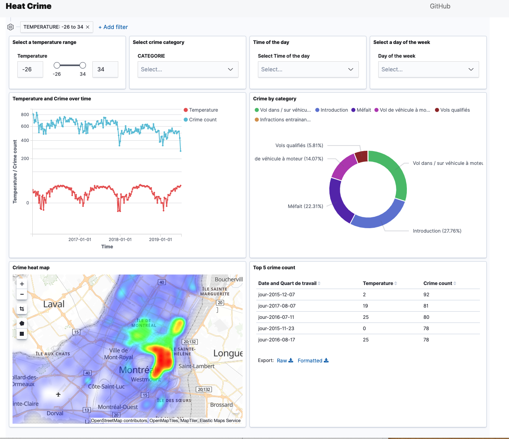

## Welcome to HeatCrime

Demo : https://moutellou.github.io/heatcrime (user and password in the submission document)

Video : https://youtu.be/k9SNqhikcmw

Is crime rate associated with higher temperature ?

We designed a tool that allows users to explore correlations between crime data from la vile de Montreal and temperature records from Environment Canada.

